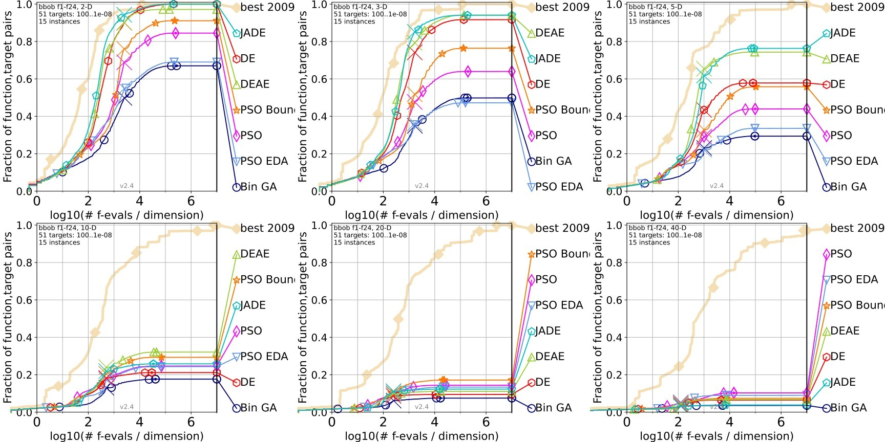

# Function Optimization Benchmarking
AI method coursework function optimization algorithm MATLAB code and datasets

# Usage
## Benchmarking
1. generate DEAE data with [experiment.m](Algorithms/experiment.m) by executing `experiment` in MATLAB
	- current setup
		1. path that points to fgeneric as "pwd" e.g. `addpath(pwd)`
		2. fgeneric `delta precision = 1e-16`
		3. `datapath = '../Datasets/ALGONAME'` (output location)
		4. `maxfunevals = '5e3'`
		5. random generator seed `rng('default')`
	
	> ** Note **
	> pre-generated datasets is included in Datasets folder
	> experiment script is located in Algorithm folder

2. post-process DEAE datasets with [numbbo framework](https://github.com/numbbo/coco/)

	```Sh
		python -m cocopp [-o OUTPUT_FOLDERNAME] YOURDATAFOLDER [MORE_DATAFOLDERS]
	```
	Example command
	```Sh
		cd BBOB2010G04\Datasets
		python -m cocopp -o ".\" "DEAE"
	```
	> **Note**   
	> Path to datasets will be used as algorithm name in ppdata, this is why we cd into the datasets

## Generate Excel Score
[see info2excel documentation](https://github.com/teoshibin/COMP2024_AIM_CW/tree/dev/info2excel)

# Results

## Post Processing
<p align="center" float="left">
  
</p>

## Excel Scores

All tested algorithm with their corresponding scores in 5d

| Algo       | Score 5d | In Report |
|------------|---------:|:---------:|
| CMAES      | 2344     | 0         |
| DEAE       | 2322     | 1         |
| JADEb      | 1941     | 0         |
| JADE       | 1868     | 1         |
| JADEctpb   | 1868     | 0         |
| DE         | 1083     | 1         |
| DEb        | 1083     | 0         |
| PSO_Bounds | 500      | 1         |
| PSO        | 234      | 1         |
| Bin_GA     | -14      | 1         |
| PSO_EDA    | -49      | 1         |


